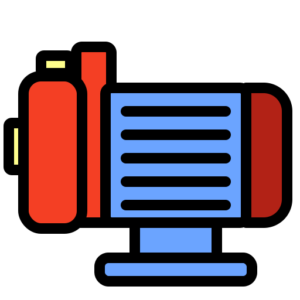

<p align="center">
  
</p>

<h1 align="center">Pump Disassembly Simulator</h1>

<p align="center">
  <strong>Интерактивный 3D-симулятор разборки и сборки насосов и компрессоров</strong>
</p>

<p align="center">
  
  
  
  
</p>

---

## 📋 О проекте

**Pump Disassembly Simulator** — это учебный 3D-симулятор от первого лица, предназначенный для обучения правильной последовательности разборки и сборки промышленных насосов и компрессоров. Проект разработан для использования в образовательных целях, позволяя студентам и специалистам отрабатывать навыки обслуживания оборудования в безопасной виртуальной среде.

### 🎯 Ключевые возможности

- **Реалистичная физика** — система моментов затяжки, ржавчина, износ деталей
- **Три режима работы:**
  - 📚 **Обучение** — подробные подсказки и помощь на каждом шаге
  - 🏋️ **Тренировка** — ограниченная помощь (пользователь самостоятельно должен решать порядок и местоположение установки детали), свобода действий
  - 📝 **Экзамен** — без подсказок, с выставлением оценки и записью протокола действий.
- **Система инвентаря** — среди инвенторя доступно 20 инструментов
- **Сценарии тренировок** — возможно загружать из внешних файлов (JSON). В них описываются жизненый цикл деталий, варинты событий для деталий (ржавчина, краска, износ, облединение)
- **Логирование сессий** — полный протокол действий с оценкой по 5-балльной системе
- **Экспорт отчётов** — сохранение в HTML и печать

## 🚀 Установка и запуск

### Требования

- [Godot Engine 4.x](https://godotengine.org/download/) (C# версия)
- .NET SDK 6.0 или новее

### Быстрый старт

1. **Клонируйте репозиторий:**
   ```bash
   git clone https://github.com/det-mey/Pump-disassembly-simulator.git
   cd Pump-disassembly-simulator
   ```

2. **Откройте проект в Godot:**
   - Запустите Godot Engine
   - Нажмите "Import" → выберите `project.godot`

3. **Запустите проект** — нажмите `F5` в редакторе Godot

### Сборка для десктопа

```bash
# В Godot Editor: Project → Export → Выберите платформу
# Или через командную строку:
godot --export-release "Linux/X11" ./build/pump-disassembly-simulator.x86_64
```

## 📂 Структура проекта

```
├── Assets/                # Ресурсы: модели, текстуры, звуки, иконки
│   ├── Models/            # 3D-модели (.glb)
│   ├── Sounds/            # Звуковые эффекты (.mp3)
│   ├── Icons/             # Иконки предметов
│   ├── Materials/         # Материалы
│   └── UI/                # Элементы интерфейса
├── Scenes/                # Сцены Godot (.tscn)
├── Scripts/               # C# скрипты
│   ├── Core/              # Ядро: GameManager, Player, менеджеры
│   ├── Mechanics/         # Механики: Fastener, BasePart, ItemData
│   └── UI/                # Интерфейс: UIManager, MainMenu, Settings
├── Resources/             # Godot-ресурсы (.tres)
│   ├── Details/           # Конфигурации деталей
│   ├── Tools/             # Конфигурации инструментов
│   └── Maps/              # Конфигурации сценариев
└── Config/                # JSON-конфигурации сценариев
```

## 🎮 Управление

| Клавиша | Действие |
|---------|----------|
| `WASD` | Передвижение |
| `Мышь` | Обзор камеры |
| `Shift` | Спринт |
| `Ctrl` | Приседание |
| `ЛКМ` | Взаимодействие (удержание для резьбы) |
| `ПКМ` | Подбор/снятие детали |
| `Tab` | Открыть инвентарь |
| `1-5` / `Колесо` | Переключение слотов хотбара |
| `F` | Выбросить предмет |
| `Esc` | Меню паузы |
| `~` | Консоль разработчика |
| `F2` | Переключить режим призраков |

## 🛠️ Технические особенности

### Архитектура

Проект построен на системе **синглтон-менеджеров** с **JSON-драйвеной** системой сценариев:

| Менеджер | Ответственность |
|----------|----------------|
| `GameManager` | Загрузка сценариев, валидация, ghost-режим |
| `ActionLogger` | Логирование, очки, штрафы, отчёты |
| `SequenceManager` | JSON-сценарии, проверка условий (AND/OR/NOT/STATE) |
| `InventoryManager` | Инвентарь (20 слотов, 5 хотбар) |
| `Player` | FPS-контроллер, камера, взаимодействие |
| `CameraController` | Динамика камеры: sway, head-bobbing, приседание |
| `UIManager` | HUD, инвентарь, пауза, тултипы |

### Ключевые паттерны

- **Data-driven design** — всё настраивается через `.tres` ресурсы и JSON
- **Event-driven** — события для обновления UI и инвентаря
- **Рекурсивная проверка условий** — AND/OR/NOT/STATE в SequenceManager
- **Интерфейс `IInteractable`** — единый контракт для всех интерактивных объектов
- **Программный UI** — весь интерфейс генерируется кодом, без `.tscn`

## 📝 Создание сценария

1. Создайте сцену в Godot с деталями (`BasePart`, `Fastener`)
2. Укажите `PartId` для каждой детали
3. Создайте JSON-файл сценария:

```json
{
  "groups": [
    {
      "name": "Снятие крышки",
      "steps": [
        {
          "target": "cover_bolt_1",
          "condition": { "type": "STATE", "expected": "Removed" },
          "points": 10
        }
      ]
    }
  ]
}
```

4. Создайте `ScenarioData` ресурс в Godot
5. Добавьте сценарий в `MainMenu.Scenarios`

## 📊 Система оценки

| Оценка | Критерий |
|--------|----------|
| **5 (Отлично)** | ≥95% выполнения, ≥90% точности |
| **4 (Хорошо)** | ≥80% выполнения, ≥70% точности |
| **3 (Удовл.)** | ≥50% выполнения |
| **2 (Незачет)** | <50% выполнения |
| **1 (Авария)** | Штраф ≥50 баллов |
